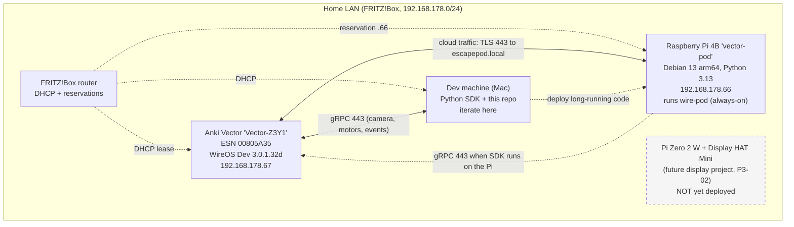
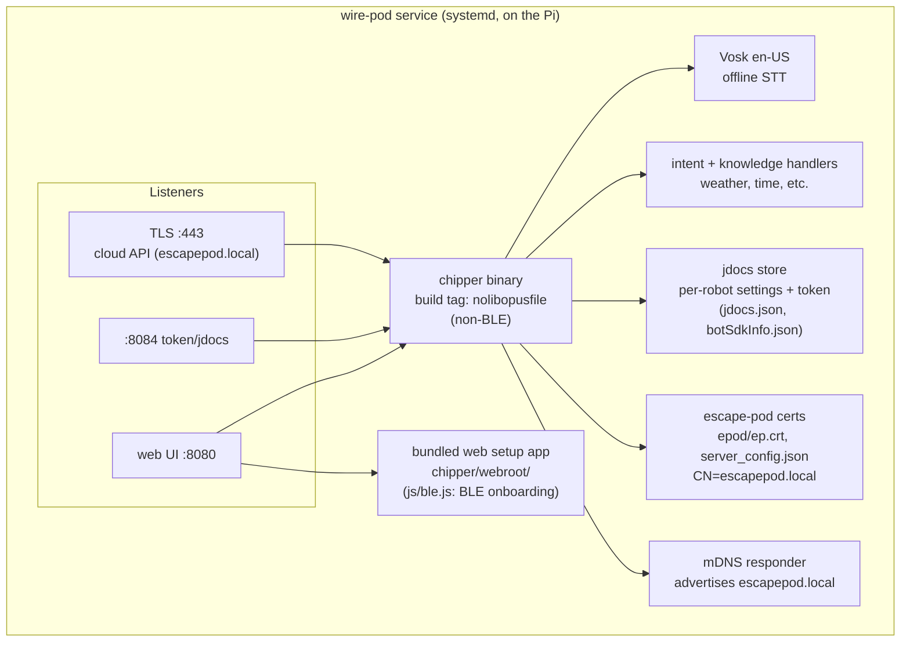
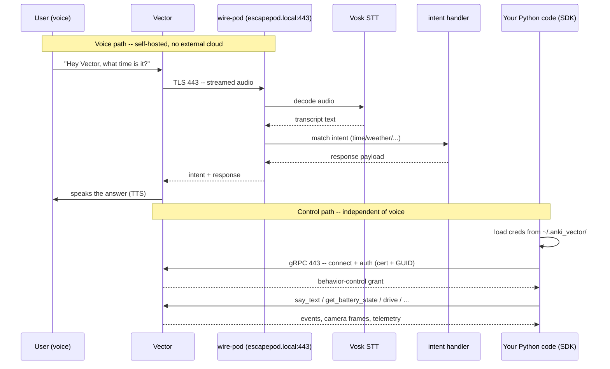

# Architecture

How the pieces connect once everything is set up. Three views: the
hardware/network layout, what runs inside wire-pod, and how a voice command and
an SDK command actually flow end to end.

The concrete facts (firmware versions, IPs, the dead ends) live in
`setup-vector.md` and `landscape.md`; this file is the map.

## View A: hardware and network

Everything sits on one LAN behind a FRITZ!Box router. Two addresses are pinned
by DHCP reservation so configs stay valid across reboots (see P1-03): the Pi at
`.66` and (intended) Vector at `.67`.

- `escapepod.local` resolves to the Pi: wire-pod advertises that name via its
  own mDNS, in addition to the Pi's real hostname `vector-pod.local`.
- The control path (gRPC) and the voice path (TLS to `escapepod.local`) both
  use port 443 on the robot/Pi but are independent: the SDK can run from the dev
  machine or the Pi, and proving it runs on the Pi was P3-01.
- The Pi Zero 2 W is reserved hardware, not wired in yet.

## View B: wire-pod internals

wire-pod is one Go service (the `chipper` binary) plus a Vosk model and a web
UI. We run it from a git checkout under systemd in **escape-pod mode**
(`apiConfig.json: epconfig=true`), which is what makes it serve and advertise
`escapepod.local:443` -- the name the robot authenticates against.

- **Non-BLE binary.** We compile `chipper` with only the `nolibopusfile` tag.
  An in-built-BLE build exists (`inbuiltble` tag, P2-07) but wedged the Pi 4's
  Bluetooth, so it was reverted (P2-08). BLE onboarding now runs from the
  browser-based web setup app instead.
- **escape-pod certs.** The robot expects a server presenting a
  `CN=escapepod.local` certificate on 443; `server_config.json` points the
  robot's jdocs/tms/chipper/check endpoints there.
- **jdocs** holds the robot's token and settings server-side. Clearing it
  (P2-08) is how we reset for a fresh onboard.
- **Bundled web setup app** is wire-pod's own copy of the open-source "Vector
  Web Setup" page (the same app hosted by keriganc/froggitti/techshop82, just
  pointed at different OTA backends -- see P4-02). It is served on :8080.

## View C: data flow (voice and control)

Two independent request paths reach the robot. The voice path is wire-pod
answering "Hey Vector" queries; the control path is our Python code driving the
robot over gRPC. They share port 443 on the robot but never touch each other.

- **Voice is fully local.** Audio goes to the Pi, Vosk transcribes it, an intent
  handler answers. Proven self-hosted three ways (tcpdump, stop-the-pod, and
  `server_config`) in `setup-vector.md` -- 0 packets to the old pvic.xyz cloud.
- **Control auth.** The SDK reads per-robot creds from `~/.anki_vector/`
  (written by `anki_vector.configure`), opens a gRPC channel to the robot on
  443, and requests behavior control. That first control grant can flake with a
  `_request_control` timeout; a retry succeeds (parking-lot note from P2-03).
- **Where the SDK code sits.** `prototypes/<name>/main.py` calls
  `vectorkit.robot_session()` (`libs/vectorkit/connection.py`), a thin wrapper
  over the vendored `anki_vector` SDK that handles config loading and
  connect/disconnect.

## Where code runs

- wire-pod: always on the Pi, under systemd.
- Python prototypes: anywhere on the LAN. Iterate on the dev machine; deploy
  long-running ones to the Pi (the SDK is proven to run there, P3-01).

## Credentials

The SDK stores per-robot certs and a token under `~/.anki_vector/` (written
during SDK auth). These are secret and machine-local: gitignored, never
committed. To run a prototype on a new machine, re-run `anki_vector.configure`
there. wire-pod's own escape-pod certs and the robot's token live on the Pi
(jdocs), separate from these.

## Conventions

- Shared connection/config helpers live in `libs/vectorkit/` and are imported by
  prototypes, so robot serial/IP handling exists in one place.
- Each prototype is self-contained under `prototypes/<name>/` with its own
  README and entry point.
